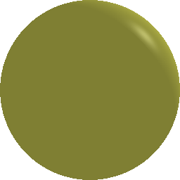

# [ShadowArt-Revisited](https://kaustubh-sadekar.github.io/ShadowArt-Revisited/)
Shadow Art Revisited: A Differentiable Rendering Based Approach

## Setup Instructions


## Create Shadow Art Using Voxel Optimization

To create shadow art with two views with files duck.png and mikey.png use the following command.
```script
python val.py cuda:0 output1 600 0.01 -swt 10.0 -l1wt 10.0 -sdlist duck.png mikey.png
```


*Gif showing the optimization of the 3D voxel shadow art*


## Create Shadow Art Using Mesh Optimization

To create shadow art with two views with files duck.png and mikey.png use the following command.
```script
python val.py cuda:0 output1 2000 0.15 0 -swt 1.6 -l1wt 1.6 -mwt 0.0 -i2vwt 0.0 -ewt 1.6 -nwt 0.6 -lwt 1.2 -sdlist duck.png mikey.png
```


*Gif showing the optimization of the 3D shadow art mesh*

